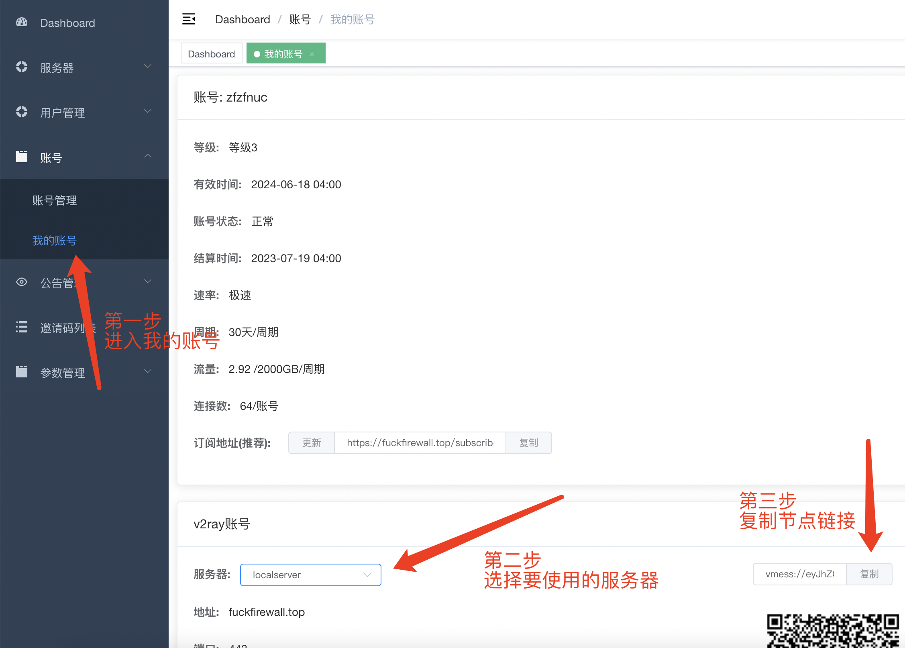

# Android系统V2rayNG客户端配置指南
## 第一步：下载安装V2rayNG客户端
[从github下载(推荐)](https://github.com/2dust/v2rayNG/releases/download/1.8.5/v2rayNG_1.8.5.apk)

[如果无法访问github，使用此链接下载]()

---

## 第二步：获取节点并导入V2rayNG

#### 方法一：节点二维码方式（推荐）
在用户界面中找到“我的账号”， 在服务器一栏中选择要使用的节点，准备好右侧的二维码供手机扫描

在手机打开V2rayNG，点击屏幕上方的加号

在出现的菜单中选择Import config from QRcode

#### 方法二：节点链接方式 (如果你选择用二维码导入，<a href="#第三步">点击此处跳转到下一步</a>)
在用户界面中找到“我的账号”， 在服务器一栏中选择要使用的节点，复制节点链接

在手机上将链接复制到剪贴板，在手机打开V2rayNG，点击屏幕上方的加号

在出现的菜单中选择Import config from Clipboard

---

## 第三步：启动代理并测试

客户端右下角的V字即为开关，将其点亮，点亮后点击“tap to check connection”进行测试

如果成功连通，将提示success
